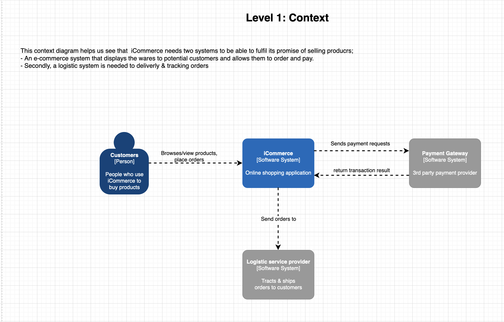
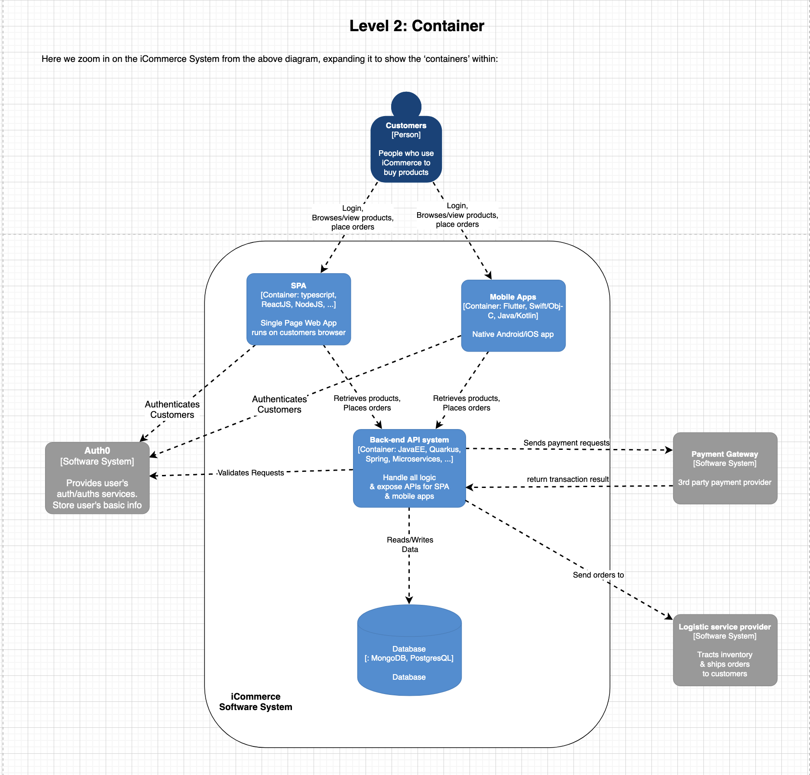
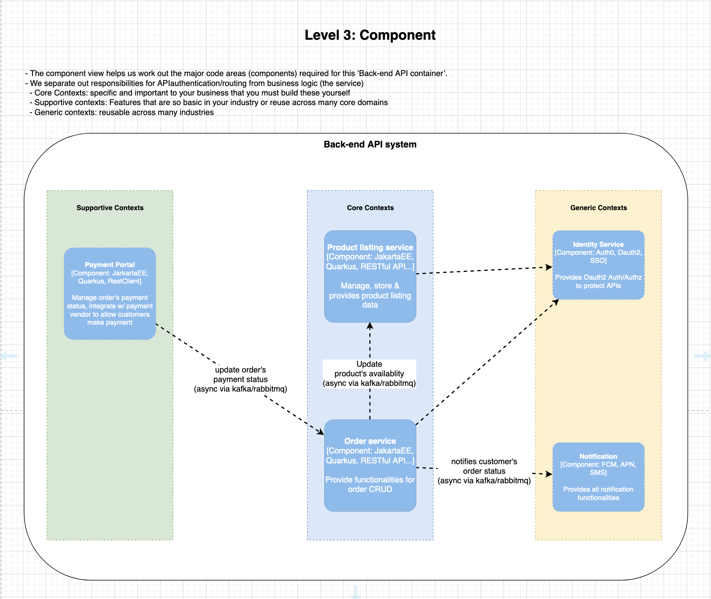
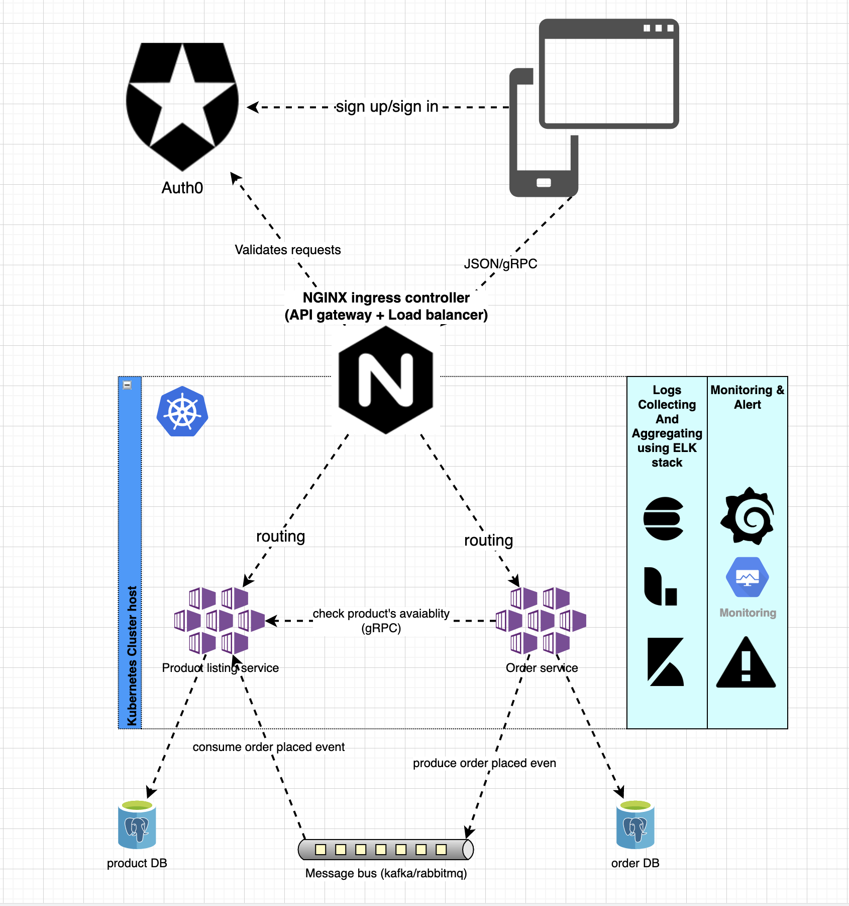
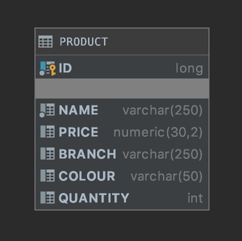
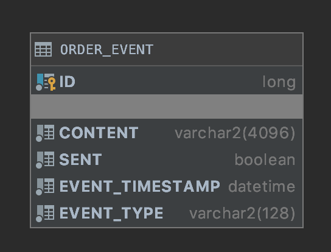

## iCommerce High-level solution diagram with c4 model







## Infrastructure


- This application contains 2 services:
  + `product-listing-service`: Manages products data and exposes API for product listing
  + `order-service`: Exposes API allows place orders and manages order events
- Inter-services communication can be synchronous using `gRPC` or asynchronous using message broker (rabbitmq)
- API gateway sits between clients and services. It acts as a reverse proxy, routing requests from clients to services.
  It may also perform various cross-cutting tasks such as authentication, SSL termination, and rate limiting.
- Logs from all containers will be collecting & aggregating using ELK (ElasticSearch-LogStash-Kibana) stack. 
  Applications should stream logs in JSON format.
- All services will be monitoring using `Prometheus`, each java application will be configured with `jeager` as java agent to monitoring JVM metrics
The metrics will be visualised on Grafana dashboard & also a Alert Manager will be added to alert any issue occurred.

## Entity relationship diagram
### Product service

### Order service


## Repository layout
- The project format is Maven multi-modules project
- There are 2 types of modules:

### Service modules 
- Contain business logic code and will be built to docker images (using `maven-jib-plugin`) and deployed as a service in microservice system. 
- e.g.
  + `product-listing-service`
  + `order-service`

### Shared modules: 
- Contain some shared codes, configs, libs, ... The modules produced by this code are intended to be consumed by service modules. 
- e.g
  + `icommerce-rest-commons`: Contains common `spring data REST` configs for exposing APIs endpoints
  + `icommerce-cloud-stream-commons`: Contains common `spring cloud stream` & `rabbitmq` configs in order to produce/consume message via message broker

## Building the code and run application locally
### Prerequisites
- The project is using Java 16
- Maven is used as the project definition format
- A Docker image build environment. To create and build a microservice Docker image, Docker must be available.

### Building the code
- With **Java 16** and **Maven 3** installed, building the application follows the typical Maven build lifecycle
- This repo has contained some pre-defined build scripts:
  + `build-project.sh`: build project
  + `build-docker-images.sh`: build project & docker images
  + `release.sh`: build project, docker images & push to docker registry
- After cloning this repo to your machine, `cd` to it run following scrip to build docker images:
```shell script
mvn clean install
```

### Deploy local
- Build the project
- Create a docker swarm
```shell script
docker swarm init --advertise-addr=127.0.0.1
```
- Deploy docker stack
```shell script
docker stack deploy -c docker/docker-stack.local.yml --prune --resolve-image always icommerce
```

- `product-service` will be run on port 8080, `order-service` will be run on port 8081 

## OpenAPI specification
- Both `product-listing-service` & `order-service` contain Swagger UI. After deploying or running services locally, they can be accessed via
  - product-listing-service: http://localhost:8080/swagger-ui.html
  - order-serviceL: http://localhost:8081/swagger-ui.html

### Product listing service
#### Get all products:
- Request:
```shell script
curl --location --request GET 'http://localhost:8080/products?name=hat&branch=lv&colour=bl&price_gte=1&pricce_lte=100'
```
- Sample Response
```json
{
  "_embedded": {
    "products": [
      {
        "id": 1,
        "name": "Hat",
        "branch": "LV",
        "price": 5.00,
        "quantity": 100,
        "colour": "black"
      }
    ]
  },
  "_links": {
    "self": {
      "href": "http://localhost:8080/products?name=hat&branch=lv&colour=bl&price_gte=1&pricce_lte=100&page=1&size=10"
    }
  },
  "page": {
    "size": 10,
    "totalElements": 1,
    "totalPages": 1,
    "number": 1
  }
}
```

### Place an order
- Request
```shell script
curl --location --request POST 'http://localhost:8081/orders' \
--header 'Content-Type: application/json' \
--data-raw '{
	"productId": 1,
	"quantity": 95,
	"customerName": "customerName",
	"customerAddress": "address"
}'
```

- Sample error response
```json
{
    "errors": [
        {
            "entity": "orderPlaced",
            "property": "productId",
            "invalidValue": 1,
            "message": "Product doesn't exists"
        }
    ]
}
```
### Get all order events
- Request
```shell script
curl --location --request GET 'localhost:8081/orderEvents' \
--header 'Content-Type: application/json'
```
- Sample Response
```json
{
  "_embedded": {
    "orderEvents": [
      {
        "id": 1,
        "content": "{\"customerName\":\"customerName\",\"customerAddress\":\"address\",\"productId\":1,\"quantity\":95,\"type\":\"OrderPlaced\"}",
        "sent": true,
        "eventTimestamp": "2020-03-09T05:45:43.294403Z",
        "eventType": "OrderPlaced",
        "_links": {
          "self": {
            "href": "http://localhost:8081/orderEvents/1"
          },
          "orderEvent": {
            "href": "http://localhost:8081/orderEvents/1"
          }
        }
      }
    ]
  },
  "_links": {
    "self": {
      "href": "http://localhost:8081/orderEvents"
    },
    "profile": {
      "href": "http://localhost:8081/profile/orderEvents"
    },
    "search": {
      "href": "http://localhost:8081/orderEvents/search"
    }
  }
}
```
 